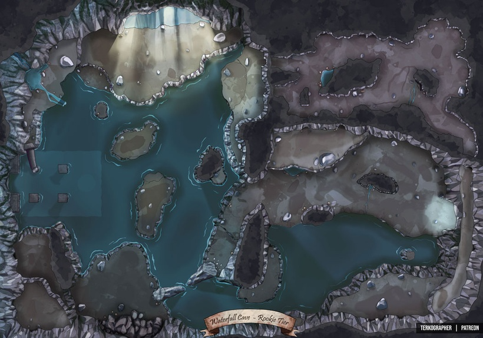

# The Dragon's Cave

## General Description
The largest of the sea caves along the coastal bluffs, this is the lair of Yurrisa, the Raging Storm. She is a juvenile blue dragon who has just flown the nest.

The cave has relatively high ceilings in the main chambers, around 40-50 feet high. The water is around 15 feet deep at it's deepest points.

## The Entrance
The main entrance is quite large - wide enough for an adult dragon to fly through with wings open and tall enough to not risk hitting the ceiling. During high-tide, the floor at the entrance to the cave is completely underwater, with the waves spilling into the water at the caves floor.

## Caves (top right)
The left entrance to the caves slopes up, rising around 10-15 feet before leveling out into the main cave chamber.

The caves are where the old smuggler caches used to be hidden. There are remnants of broken crates, barrels, and general detritus strewn about, here, that have decayed from brine and the neglect of time. However, much of these remaining objects seem to have been recently smashed or picked through.

**DC15 Survival**: There are fresh footprints in here... They look to belong to a large reptile. 18+ these are small Dragon footprints...

**DC20 Perception/Investigation**: there is a hidden cache under the rock on the far right side of the map. It contains:

- 6 bottles of fine Rum ||25gp/bottle||
- A stoppered flask that sloshes when shaken, as if it contains water. The decanter weighs 2 pounds. ||Decanter of Endless Water||
- A scroll case
  - ||A map depicting the island across the strait. There is a riddle scrawled on the bottom-right corner of the map.||
  - ||A spell scroll: Dimension Door||

*The map is a future quest hook OR, if pursued immediately, leads to a chest with 500gp*

## The Rightmost Exit and Crevasse
This is a new exit, burrowed out. It leads to a narrow crevasse between the rocks that the waves rush up and down. It appears near impossible to swim out unless you time the waves perfectly. The climb to the top is nearly 100 feet.