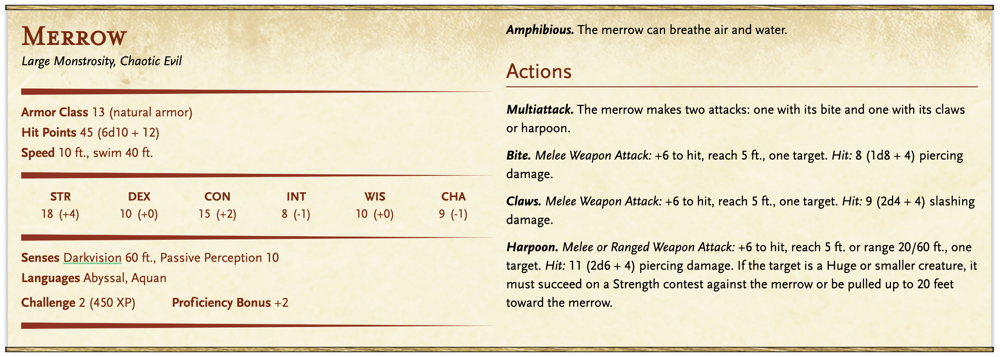
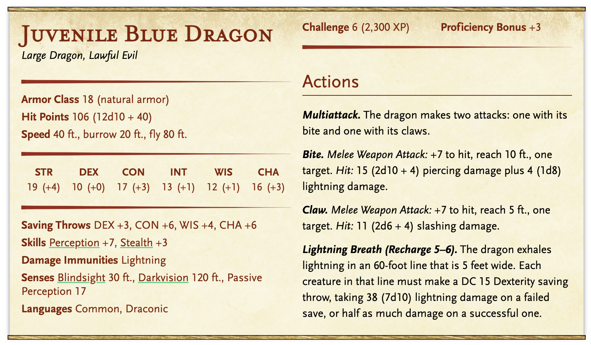

# Clearing the Trade Route

## Premise

A few local fishing boats and one private shipping vessel have disappeared in a straight of water somewhere to the north of the city. Now, captains are refusing to take that shipping lane. 

A woman, [Veldira Amaranth]() (human, a bit pudgy and rather irritable), is here representing a group of local business folk who are losing around 200gp/day while their shipping vessels are taking the longer, circuitous route around. The group would like the company to deal with whatever has been making the boats disappear.

They offer 1000gp, but starting in 3 days time they will deduct 100gp from the contract to make up for their losses. It takes about a day to sail to the channel.

The group is willing to provide a vessel to take you to the location, free of charge. It is to be crewed by 3 men, all of whom have volunteered for the mission on the basis of 3x standard pay.

### Things Veldira Knows

- Details of the [channel's terrain](#the-channel)
- There is a group of Merrow's living in the channel that sometimes harass vessels. They have been a nuisance, but posed no danger to the larger shipping boats the represented companies tend to use 
  - Local fisherman avoid the channel for this reason, though
- There was a vicious storm a few weeks back. The disappearances began the day after (red herring)

### The Sturm Island Channel

Located to the north of Genericopolis along the coastline. There are rocky bluffs along the coast, and an island on the seaward side, nearly half a mile from the coastline. The channel is a dozen miles long. There are shallow shoals that stretch out for miles into the sea from the far side of the island, which is why it takes so much extra time to circumnavigate this channel.

The channel itself contains a kelp forest, vibrant with life.

The bluffs are known to contain some sea caves that are exposed during low tide. Smugglers and pirates once used these caves to store caches of contraband or plunder.

The island is uninhabited. There's remains of a settlement there, but it was abandoned a long time ago because the weather proved too troublesome for a sustainable living.

## Monsters/Baddies

A few Merrows have cut a deal with a Juvenile Blue Dragon. The dragon help the Merrows sink the ship, and the Merrows retrieve the treasure from the shipwreck to give to the dragon. Dispatching either the Merrows or the Dragon will result in success.

- 3 [Merrows](../statBlocks/merrow.png)
- 1 [Juvenile Blue Dragon](../statBlocks/juvenileBlueDragon.png)

### Merrows

The Merrow's live on the floor of the channel within the kelp forest.

- Wants: To kill intruders to "their" kelp forest.
- Fear: Getting displaced by dirt dwellers

### The Dragon

The Juvenile Blue Dragon, named Yurrisa (the Raging Storm), lives in the largest of the sea caves along the bluffs. She moved in recently.

She is haughty and arrogant, and thinks herself much stronger than she actually is. She exhibits the naivety of youth and is rather self-conscious. Think "mean girls". She gave herself the title "the Raging Storm".

- Wants: To be feared and respected. She also wants a giant treasure hoard
- Fears: Being mocked or not taken seriously

#### Treasure Hoard: 
- 1100cp, 2000sp, 5500gp, 72pp (1481gp total)
- Assorted gemstones worth ~1100gp
- A whole bunch of worthless junk collected from the shipwrecks. She is absolutely "stuffing" her hoard to make it look bigger than it actually is

## The Ship and Its Crew
The ship, **The Ebon Tide**, is a small but fast schooner (stats of a [keelboat](../statBlocks/keelboat.png)).

**[Captain](../statBlocks/sailorCaptain.png)**: Kurt Gabbelton. A half-orc with a charming gruffness to him. He is respectful of the party despite the constant stream of little digs at them not having sailing experience.
- Wants: Craves novel experiences
- Fears: Not making it home to his wife Denise and, more importantly to him, his daughter Anabelle

**[Sailors](../statBlocks/sailor.png)**: Diggs (stout-halfling male, one of the beefiest halflings you've ever seen) and Beckam (human female, lean but deceptively strong).

Diggs:
- Wants: Cash to fuel his gambling addiction.
- Fears: Falling behind on his debts

Beckam:
- Wants: Freedom to do as she pleases
- Fears: Being controlled or manipulated